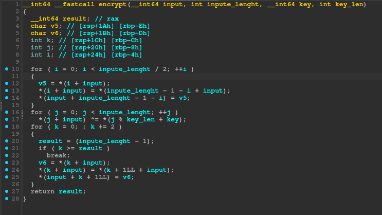

````markdown
# Challenge 2 (Custom Encryption Reverse)

> **Note:** It's recommended to read the Challenge 1 writeup first since this challenge is an extension of it.

### Step1 (Initial analysis):
> ###### Opening the binary in IDA, it looks very familiar to Challenge 1 except:
> - The hex blob is **different**
> - The key is **different**
> - The encryption algorithm is **different**
>
> 
>
> ###### Let's inspect the encryption function.

### Step2 (Understanding the encryption algorithm):
> ###### The custom encryption function has **3 for loops**:
>
> 
>
> ###### **Loop 1 — Reverse the array** (loops only halfway):
> ```
> v5 = input[i]
> input[i] = input[input_len - 1 - i]
> input[input_len - 1 - i] = v5
> ```
> It swaps first with last, second with second-to-last, etc:
> ```
> before: 1 2 3 4 5 6
> after:  6 5 4 3 2 1
> ```
>
> ###### **Loop 2 — XOR with repeated key** (same as Challenge 1):
> XORs each byte of the input with the key, repeating the key using modulo.
>
> ###### **Loop 3 — Swap adjacent pairs** (increments by 2):
> ```
> v6 = input[k]
> input[k] = input[k + 1]
> input[k + 1] = v6
> ```
> It swaps 1st↔2nd, 3rd↔4th, 5th↔6th, etc:
> ```
> before: 1 2 3 4 5 6
> after:  2 1 4 3 6 5
> ```
>
> ###### After this custom encryption function ends, it compares with the hex blob using `memcmp` and prints if correct or not.

### Step3 (Reversing the algorithm):
> ###### The key insight is that **each step is self-inverting** — applying the same operation again reverses it (XOR undoes XOR, swapping undoes swapping, reversing undoes reversing).
> ###### Since we're decrypting, we call them in **reverse order**: Loop 3 → Loop 2 → Loop 1.
> ```c
> void decrypt(char *buf, int len, char *key, int keylen) {
>     // 1. Undo swap pairs
>     for(int i = 0; i < len - 1; i += 2) {
>         char tmp = buf[i];
>         buf[i] = buf[i + 1];
>         buf[i + 1] = tmp;
>     }
> 
>     // 2. Undo XOR
>     for(int i = 0; i < len; i++) {
>         buf[i] ^= key[i % keylen];
>     }
> 
>     // 3. Undo reverse bytes
>     for(int i = 0; i < len / 2; i++) {
>         char tmp = buf[i];
>         buf[i] = buf[len - 1 - i];
>         buf[len - 1 - i] = tmp;
>     }
> }
> ```
> ###### We extract the hex blob the same way as Challenge 1 and note that the key used here is `"terces"` (which is `"secret"` reversed). Calling the decrypt function gives us the flag.

**Flag:**
```
CSCC{obscurity_is_not_real_security}
```
````
