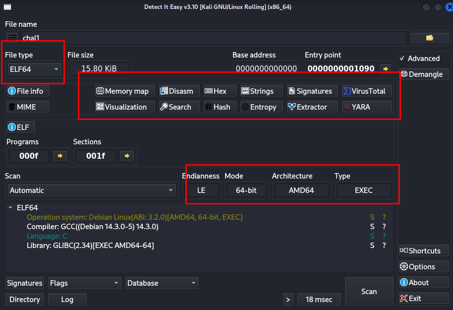
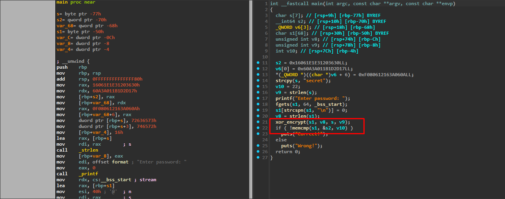
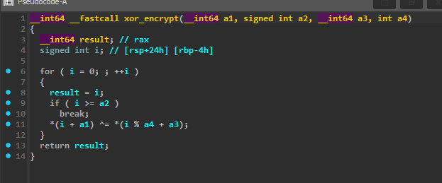
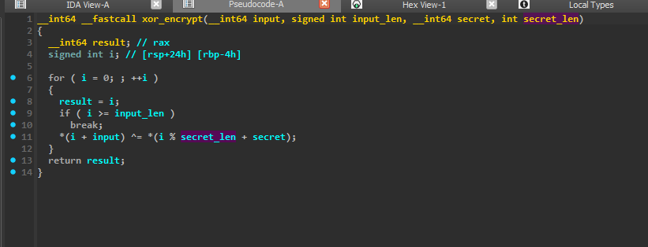
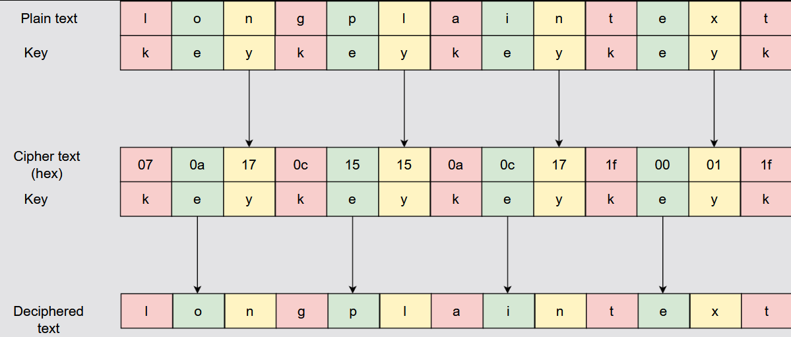

# Challenge 1 (XOR Reverse Engineering)

### Step1 (Identifying the binary):
> ##### First thing first, when we see a binary file we need to know what type of file we are dealing with — is it for Windows, Linux, 64-bit, 32-bit, etc.
> ###### In Linux we can use the `file` command to reveal basic information:
> ```bash
> └─$ file chal1
> chal1: ELF 64-bit LSB executable, x86-64, version 1 (SYSV), dynamically linked,
> interpreter /lib64/ld-linux-x86-64.so.2, for GNU/Linux 3.2.0, not stripped
> ```
> ###### We can see it's an **ELF** (Executable and Linkable Format — Linux executable) and it's **64-bit**. The architecture (x86-64) helps us understand how arguments are passed and syscalls are used — important when dealing with assembly/debuggers.
> ###### It's also **not stripped**, which is great — it means developer symbols like variable names and sizes are preserved inside the binary (e.g. `char flag[32]` stays readable instead of becoming `lvar565`).
>
> ###### We can also use **DIE (Detect It Easy)** which has a graphical interface and can reveal advanced information like crypting and packing:
>
> 

### Step2 (Decompiling with IDA):
> ###### We open the binary in **IDA** to decompile it:
>
> 
>
> ###### The decompiled code is easy and readable. Let's break it down line by line:
> - It copies `"secret"` to `s` → `char s[] = "secret"`
> - `v9` contains the length of `s` → `int v9 = strlen(s)` (which is 6)
> - It prints a prompt, then scans user input and stores it in `s1`
> - It removes the newline from the end of input string `s1`
> - `v8` = length of user input → `int v8 = strlen(s1)`
> - It calls `xor_encrypt(s1, v8, s2, v9)` — i.e. `xor_encrypt(input, input_len, secret, secret_length)`

### Step3 (Inspecting xor_encrypt):
> ###### Let's inspect the `xor_encrypt` function:
>
> 
>
> ###### We can rename the parameters to make it more readable:
>
> 
>
> ###### The function XORs user input with the word `"secret"`. In XOR, when the key is smaller than the input, we repeat the key to match the length (using modulo `%`).
> ###### After XOR, it uses `memcmp` to compare the result against a hex blob — then displays if it matches or not.

### Step4 (Breaking the encryption):
> ###### Since XOR is reversible (`A ^ B ^ B = A`), we just need to XOR the hex blob back with the key `"secret"` to recover the original password:
>
> 
>
> ###### To get the hex blob from IDA, we set a breakpoint on the `memcmp` call and inspect `s2` in the hex view:
>
> 
>
> ###### We copy the bytes:
> ```
> 30 36 20 31 1E 1E 06 16  17 2D 1D 1B 01 3A 0A 06
> 3A 16 12 06 08 0F 00 00  00 00 00 00 00 00 00 00
> ```

### Step5 (Writing the decryption script):
> ###### We write a C script to XOR the blob with the repeated key:
> ```c
> #include <stdio.h>
> #include <string.h>
> 
> void xor_encrypt(char *buf, int len, char *key, int keylen) {
>     for(int i = 0; i < len; i++) {
>         buf[i] ^= key[i % keylen];
>     }
> }
> 
> void main(){
>     char target[] = {
>         0x30, 0x36, 0x20, 0x31, 0x1E, 0x1E, 0x06, 0x16,
>         0x17, 0x2D, 0x1D, 0x1B, 0x01, 0x3A, 0x0A, 0x06,
>         0x3A, 0x16, 0x12, 0x06, 0x08, 0x0F, 0x00, 0x00,
>         0x00, 0x00, 0x00, 0x00, 0x00, 0x00, 0x00, 0x00
>     };
>     char key[] = "secret";
>     int keylen = strlen(key);
>     int buflen = sizeof(target);
>     xor_encrypt(target, buflen, key, keylen);
>     printf("Flag: %s\n", target);
> }
> ```
> ###### Running it we get the flag (the extra bytes after `}` are just because we copied more than needed from hex view):

**Flag:**
```
CSCC{just_xor_it_back}
```
