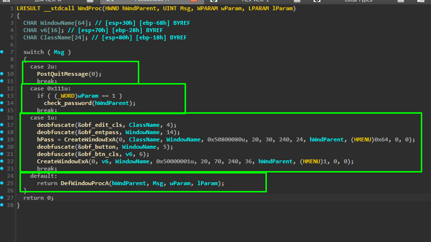
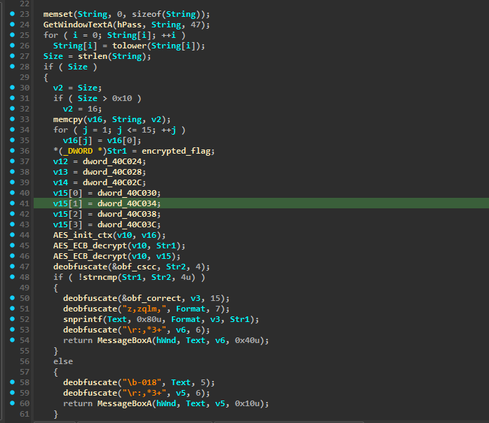

# Vibe Coder's AES (Windows GUI Reverse Engineering)

### Step1 (Identifying the binary):
> ###### Using the `file` command or **DIE (Detect It Easy)** we can see it's a Windows GUI executable:
> ```bash
> └─$ file chal3.exe
> chal3.exe: PE32 executable for MS Windows 4.00 (GUI), Intel i386, 15 sections
> ```
> ###### We need to use **Wine** to run it on Linux or have a Windows system.
>
> ###### Running the app, we see a GUI that prompts us to type a password then click check.

### Step2 (Decompiling with IDA):
> ###### When using IDA as a decompiler, we see a lot of generated template code related to the GUI — this is normal for Windows GUI apps. With experience you'll memorize where the user code lives.
>
> ###### First, scroll to the bottom until you find:
> ```c
> return WinMain(ModuleHandleA, 0, CommandLineA, wShowWindow);
> ```
> ###### Click on `WinMain`. This page contains information about the window itself (icon, title, colors, etc.) — not interesting for us.
>
> 
>
> ###### Then go to `WndClass.lpfnWndProc = WndProc;` and click on `WndProc` — this is where the user code lives.

### Step3 (Analyzing user interaction):
> ###### `WndProc` handles user interaction with buttons, text fields, keyboard input, etc.
>
> 
>
> ###### The important cases:
> - `case 1u → WM_CREATE` — window is being created (not interesting)
> - `case 2u → WM_DESTROY` — window is closing (not interesting)
> - `case 0x111u` — this is where the **check button** is handled:
> ```c
> if ( (_WORD)wParam == 1 )
>     check_password(hWndParent);
> ```
> ###### Let's dive deeper into `check_password`.

### Step4 (Understanding the key generation flaw):
> ###### Inside `check_password`:
>
> 
>
> ###### It reads the user input from the text bar, converts it to lowercase, then takes only the first 16 characters.
>
> ###### Then comes the **crucial bug**:
> ```c
> for ( j = 1; j <= 15; ++j )
>     v16[j] = v16[0];
> ```
> ###### This overwrites the entire key buffer with just the **first character** duplicated 16 times!
> - Input `CSCC` → key becomes `cccc...` (16 times, lowercased)
> - Input `test` → key becomes `tttt...` (16 times)
>
> ###### Then it uses this key to AES-decrypt a hex blob and verifies correctness.

### Step5 (Brute forcing the key):
> ###### Since only the **first character** matters, and everything is lowercased, the keyspace is tiny:
> ```
> abcdefghijklmnopqrstuvwxyz0123456789!@#$%^&*()_+-=[]{}|;:,.<>?/~`"'
> ```
> ###### We simply test each character one by one. When we reach the letter **`t`**, we get the flag.

**Flag:**
```
CSCC{brut3_f0rc3_th3_k3y_byt3}
```
